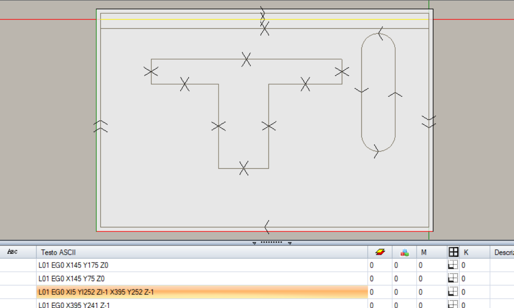

# TribuExporter user guide

[README](../README.md) · [Guida italiana](GUIDA_UTENTE_IT.md)

TribuExporter exports geometry from one Fusion 360 solid to a TpaCAD `.tcn`
piece. It is designed for plywood and panel components whose removed material
is already represented in the final BRep body.

The exporter creates selectable geometry. TpaCAD remains responsible for
setups, tools, compensation, depth passes, entry and exit, sequencing, and all
other CAM decisions. Native simple blind holes are one explicit, disabled-by-
default exception: when enabled, they are emitted as TPA hole workings.

## Before exporting

- Work from a solid body, not from sketches or an STL mesh.
- Make sure the body represents the finished part.
- Decide which physical surface will be TPA `SIDE1`.
- Know which edge should define the stock's positive X direction.
- Leave unsupported or unwanted machining regions unchecked.

## Define the panel frame

Run **Utilities → Export TpaCAD Geometry**, then select:

1. **SIDE#1** — the main planar face and the body to export. Its outward normal
   defines panel `+Z`.
2. **P0** — the reference point for the manufacturing frame.
3. **PX** — a point defining the direction `P0 → PX`. This becomes panel `+X`
   after projection onto SIDE1.
4. **PY** — a point that only chooses the positive side of `Y`. It does not
   force Y to follow a possibly non-square model edge.

The exporter always constructs an orthogonal, right-handed frame. Fusion world
XYZ and component placement do not define the TPA orientation.

## Export options

### Fictive faces (SIDE7+)

Select only planar inclined BRep faces that are intentionally useful as TpaCAD
machining coordinate systems. Each selected face receives its own additional
TPA side, starting at `SIDE7`, with an exact right-handed P0/P1/P2 frame and
its own trimmed boundary loops at local `Z=0`.

Do not select every inclined face automatically. A sloped surface made by a
saw cut or an oriented operation may be better represented later by its actual
manufacturing operation.

### Stock

**Stock allowance each side** expands the fixed-orientation body footprint.
The finished geometry is translated inside that stock; it is never stretched,
rotated, or corrected to fit.

Use **Actual stock width/height** when a larger known sheet must be declared.
Zero means the minimum calculated stock size.

### Curve chordal tolerance

The default `0.01 mm` chordal tolerance applies only when a bounded planar
curve cannot be emitted as a native TPA primitive and must be linearized.

- Lines remain exact lines.
- Circular arcs and circles remain exact arcs/circles.
- Existing endpoints are never moved.
- The tolerance is never silently relaxed.

Coordinates are calculated in millimetres and written to four decimal places;
the maximum coordinate quantization is below `0.00005 mm`.

### Duplicate SIDE1 loop filter

**Suppress SIDE1 Z=0 loop when identical deeper loop exists** prevents an
identical reference loop at the top surface from being written twice when a
selected deeper SIDE1 profile owns the same complete XY boundary. It affects
only TCN output. It never changes the geometry model or removes the mandatory
finished outer contour.

### Native Fusion blind holes

**Export native Fusion simple blind holes (W#81 CAM)** is off by default. When
enabled, the exporter scans only native `HoleFeature` timeline objects that
modify the selected body. A hole-looking cylinder, imported body, DXF circle,
extruded cut, or ordinary BRep face is not inferred as a hole.

The first supported case is an untapped, simple, distance-defined blind hole.
Its modelled entry BRep face determines the real or selected fictive TPA side;
the center is transformed into that side's local XY coordinates, and depth is
written as negative inward Z. Through All, counterbore, countersink, tapped,
clearance, ambiguous-entry, SIDE2, and otherwise unsupported HoleFeatures are
reported and omitted.

This option writes executable TPA `W#81` point workings. It specifies diameter,
but deliberately emits no `#205` tool choice. Always verify SIDE, center,
diameter, and negative depth in TpaCAD before machine execution. The checkbox
state is saved on the Fusion body after a successful export.

#### Repeated holes: use a sketch-point pattern

Do not pattern the completed HoleFeature with Fusion's Rectangular, Circular,
or Path Pattern feature when W#81 export is required. Fusion keeps the original
hole as the only native HoleFeature and represents the copies as PatternFeature
elements. TribuExporter deliberately does not expand those copies into hole
workings.

Instead:

1. Create the hole-position sketch point.
2. Pattern the sketch point or points in the sketch.
3. Create one native HoleFeature using all resulting sketch points.

TribuExporter reads every position owned by that native HoleFeature and can
emit one W#81 working per point. Boundaries produced by an unsupported feature
pattern are still ordinary final-body BRep geometry, so some may appear in the
optional profile checklist—often on a lateral face. Leave those profiles
unchecked when they are not intended as contour geometry.

## Choose profiles

After SIDE1, P0, PX, and PY are complete, the **Profiles to export** checklist
is populated.

- The finished whole-body outer contour is mandatory.
- New SIDE1 candidates default on.
- New lateral SIDE3–SIDE6 candidates default off.
- Selected inclined faces are emitted on SIDE7+.
- Successful export stores numeric settings and profile choices on the Fusion
  body so the next export can restore them.

Accessibility decides which TPA side can own a face; the checklist decides
whether you want that geometry in the current program. One Fusion BRep face is
never merged with another merely because both have the same depth or touching
endpoints.

## What to expect in TpaCAD



The example shows a finished outer contour, a recessed T-shaped contour, and a
handle opening. Each accepted boundary starts as an independent TPA profile,
so an operator can select it and assign its own setup without bridging into a
neighbouring contour.

Real lateral sides use ordinary TpaCAD local coordinates:

```text
-Y → SIDE3    +X → SIDE4    +Y → SIDE5    -X → SIDE6
```

On lateral sides, local Y runs from the stock bottom (`0`) to the top (`DS`),
and negative local Z is inward machining depth. Fictive faces appear in
addition to the six standard sides as `SIDE7+`.

## Mandatory review

Before creating executable CAM:

1. Check `DL`, `DH`, and `DS` against the real stock.
2. Open every populated SIDE and inspect its local orientation.
3. Verify the mandatory outer contour against the complete Fusion body.
4. Click every contour independently and confirm no unrelated profile is
   selected with it.
5. Verify every geometric Z/depth.
6. Inspect linearized curves at the declared tolerance.
7. Confirm no unexpected or unsupported region was exported.
8. If native holes were enabled, verify every W#81 SIDE, X, Y, negative depth,
   and diameter; confirm no unwanted hole-looking geometry became a working.
9. Apply technology in TpaCAD and run the normal machine-side simulation and
   safety checks.

Stop if any stock dimension, side assignment, contour, depth, or orientation
does not match the Fusion model.
